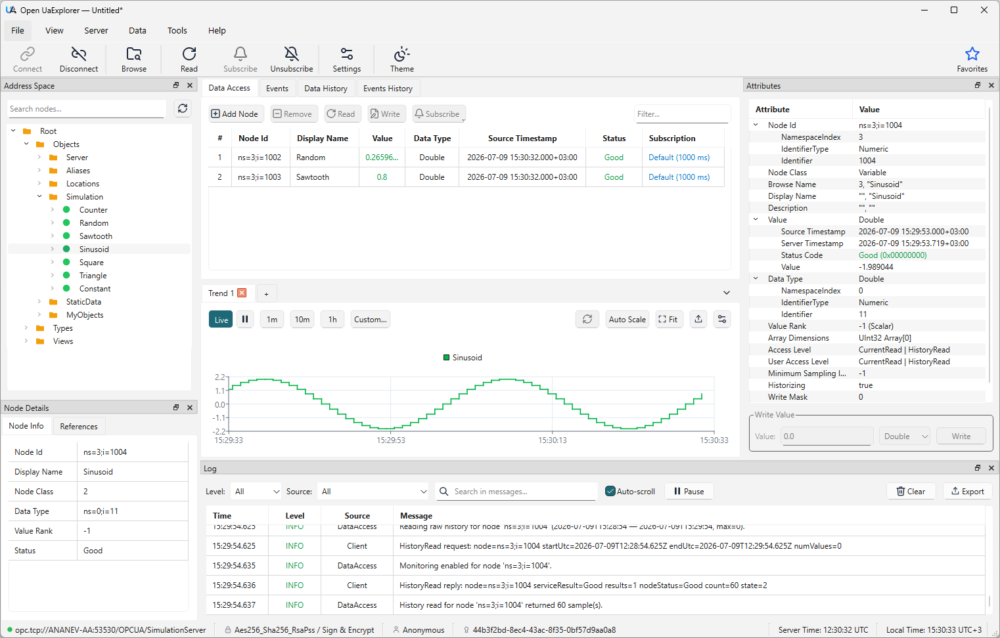
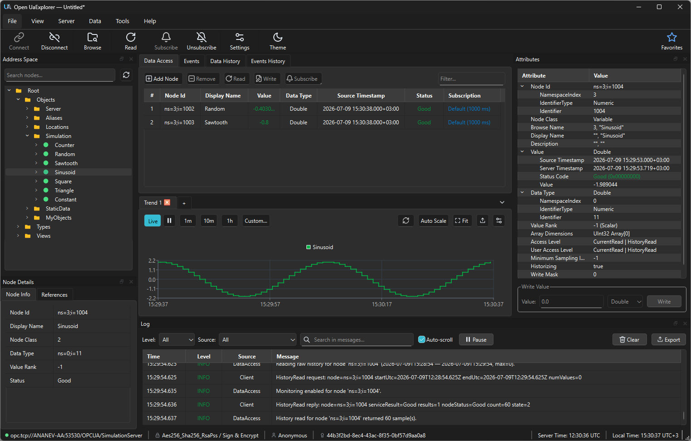

# OpenUaExplorer

[](https://github.com/sanny32/OpenUaExplorer/actions/workflows/test-ci.yml)
[](https://github.com/sanny32/OpenUaExplorer/releases/latest)
[](LICENSE)

OpenUaExplorer is an open source OPC UA client for browsing, inspecting, and monitoring OPC UA servers.


*A monitoring session in the light theme: live values, a trend graph and the activity log.*


*The same session in the dark theme.*

## Download

Prebuilt packages are published on the
[Releases](https://github.com/sanny32/OpenUaExplorer/releases) page:

-  **Windows** — installer (`ouaexp-<version>-win64-setup.exe`).
-  **macOS** — disk image (`.dmg`, Apple silicon).
-  **Linux** — portable AppImage that runs on any recent distribution, plus
  native `.deb` (Debian, Ubuntu) and `.rpm` (Fedora, openSUSE, ALT Linux and
  other RPM-based distributions) packages.

## Features

- Discover server endpoints and connect with any standard security policy —
  `None`, `Basic128Rsa15`, `Basic256`, `Basic256Sha256`, `Aes128_Sha256_RsaOaep`,
  `Aes256_Sha256_RsaPss` — in `Sign` or `Sign & Encrypt` mode.
- Authenticate anonymously, with username and password, or with an X.509
  client certificate; manage certificates and trust decisions in the built-in
  certificate store.
- Browse the OPC UA address space, inspect node attributes and references,
  write attribute values, and call methods from the node context menu.
- Watch live values in the Data Access panel — just drag nodes onto it.
- Create subscriptions with configurable publishing intervals and monitor
  data changes and events.
- Read data and event history for nodes that provide it.
- Plot subscribed values as live trend graphs.
- Keep favorite servers and recent connections at hand; save a session and
  restore it later.
- Follow client activity in the built-in log.
- Switch between light and dark application themes.

## Quick start

You do not need your own server to try the client — any public OPC UA demo
server works, for example `opc.tcp://opcua.demo-this.com:51210/UA/SampleServer`
(Unified Automation) or
`opc.tcp://uademo.prosysopc.com:53530/OPCUA/SimulationServer` (Prosys).

1. Choose **File → New Connection**.
2. Enter the endpoint URL of the server and click **Discover Endpoints**.
3. Pick an endpoint with the security policy you want, choose the
   authentication mode — **Anonymous** works for the demo servers — and click
   **Connect**.
4. Browse the address space on the left and drag a variable node onto the
   **Data Access** panel to watch its value live.

## System requirements

The application runs on:

-  **Windows** 10 or later (x64)
-  **macOS** 15 or later (Apple silicon)
-  **Linux** — any recent x86-64 distribution; the AppImage needs glibc 2.31 or
  newer, and native packages target the distributions listed under
  [Linux](#linux).

## Building

The repository ships helper scripts that install the required build tools and
Qt 6.9 or newer, configure the project and build it — usually in a single
command: `build.sh` on Linux and macOS, and `build.ps1` on
[Windows](#windows). What exactly the scripts install, and how to run the test
suite and measure coverage, is described in
[BUILDING.md](BUILDING.md).

```sh
./build.sh
```

Options:

| Option              | Description                                              |
|---------------------|----------------------------------------------------------|
| `--tests`           | Build and run the test suite after building.             |
| `--install[=PREFIX]`| Install after building (optionally into `PREFIX`).       |
| `--help`            | Show usage.                                              |

The Windows script exposes the same options as PowerShell switches — see
[Windows](#windows).

### Linux

`build.sh` detects the distribution and installs the needed packages, so it
needs `sudo` (or to be run as root) the first time. Supported package managers:
Debian/Ubuntu (`apt`), Fedora/RHEL/Rocky (`dnf`), ALT Linux (`apt-get`),
openSUSE (`zypper`) and Arch (`pacman`).

The build is continuously tested on:

-  **Ubuntu Linux** 22.04, 24.04 and 26.04
-  **Debian** 12 and 13
-  **Fedora Linux** 43 and 44
-  **Rocky Linux** 10.1
-  **RED OS** 8
-  **Astra Linux** 1.7 and 1.8
-  **ALT Linux** 11
-  **openSUSE Tumbleweed**
-  **Arch Linux**

Build only:

```sh
./build.sh
```

Build, then install:

```sh
./build.sh --install
```

### macOS

The build is continuously tested on:

-  **macOS** 26 and 15 (Apple silicon)

Recent macOS releases with the prerequisites below should also work.

Prerequisites — install these once:

- **Xcode Command Line Tools**: `xcode-select --install`
- **[Homebrew](https://brew.sh)**

`build.sh` then installs the remaining dependencies through Homebrew and builds
the app bundle:

Build only:

```sh
./build.sh
```

Build, then install (into `$HOME/Applications` by default):

```sh
./build.sh --install
```

### Windows

Windows builds use the `build.ps1` PowerShell script. The build is continuously
tested on:

-  **Windows** 10 and 11 (x64, MSVC)

`build.ps1` installs the missing build tools and Qt 6 automatically, then
builds the app with Ninja and MSVC.

Prerequisites — install these once:

- A **package manager**: [winget](https://aka.ms/getwinget) (ships with Windows
  11 and recent Windows 10) or [Chocolatey](https://chocolatey.org/install).
  `build.ps1` uses it to install any missing build tools. Confirm it is available
  with `winget --version` (or `choco --version`).
- **Visual Studio 2022** with the *Desktop development with C++* workload, or let
  the script install the Build Tools through your package manager.

PowerShell blocks unsigned scripts by default, so run it with an execution-policy
override (no administrator rights required):

```powershell
powershell -ExecutionPolicy Bypass -File .\build.ps1
```

Options:

| Option                    | Description                                          |
|---------------------------|------------------------------------------------------|
| `-Tests`                  | Build and run the test suite after building.         |
| `-Install`                | Install after building.                              |
| `-InstallPrefix <PREFIX>` | Install after building into `PREFIX`.                |
| `-Help`                   | Show usage.                                          |

Build only:

```powershell
powershell -ExecutionPolicy Bypass -File .\build.ps1
```

Build, then install (into `C:\Program Files\Open UaExplorer` by default; the
default location needs an elevated *Administrator* PowerShell):

```powershell
powershell -ExecutionPolicy Bypass -File .\build.ps1 -Install
```

### Manual CMake build

If you already have Qt 6.9 or newer and a compiler installed, you can configure
and build directly with CMake (point `CMAKE_PREFIX_PATH` at your Qt kit):

```sh
cmake -S src -B build -DCMAKE_PREFIX_PATH=/path/to/Qt/6.9/<kit>
cmake --build build --parallel
```

## Feedback

Found a bug or missing a feature? Open an issue in the
[issue tracker](https://github.com/sanny32/OpenUaExplorer/issues).
Pull requests are welcome.

## MIT License

Copyright 2026 Alexandr Ananev [mail@ananev.org]

Permission is hereby granted, free of charge, to any person obtaining a copy of this software and associated documentation files (the "Software"), to deal in the Software without restriction, including without limitation the rights to use, copy, modify, merge, publish, distribute, sublicense, and/or sell copies of the Software, and to permit persons to whom the Software is furnished to do so, subject to the following conditions:

The above copyright notice and this permission notice shall be included in all copies or substantial portions of the Software.

THE SOFTWARE IS PROVIDED "AS IS", WITHOUT WARRANTY OF ANY KIND, EXPRESS OR IMPLIED, INCLUDING BUT NOT LIMITED TO THE WARRANTIES OF MERCHANTABILITY, FITNESS FOR A PARTICULAR PURPOSE AND NONINFRINGEMENT. IN NO EVENT SHALL THE AUTHORS OR COPYRIGHT HOLDERS BE LIABLE FOR ANY CLAIM, DAMAGES OR OTHER LIABILITY, WHETHER IN AN ACTION OF CONTRACT, TORT OR OTHERWISE, ARISING FROM, OUT OF OR IN CONNECTION WITH THE SOFTWARE OR THE USE OR OTHER DEALINGS IN THE SOFTWARE.

